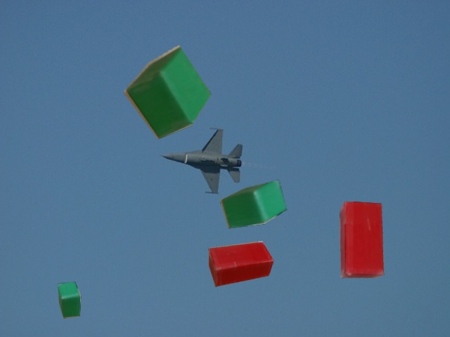
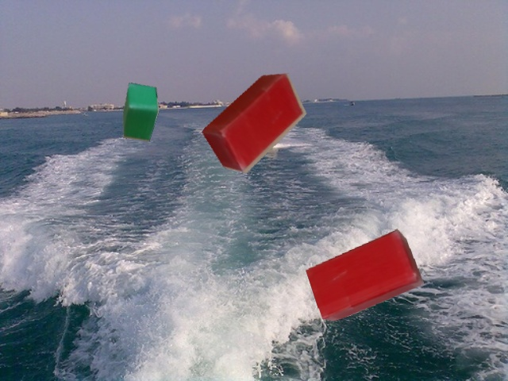

# Data Augmentation
data augmentation tool for object detection and segmentation (random synthesis)

## Generated Images
{: width="50%" height="50%"} {: width="50%" height="50%"}

## Requirement
* python 2.7
* opencv-python
* numpy
* imutils

## Data Organization
* data-augmentation
  * bg (background images)
   * 1.jpg
   * 2.jpg
   * ...
   * 100.jpg
  * dataset (save path)
   * Images: Synthesized rgb images
   * labels: labels for YOLO training
   * Masks: Masks for each object (segmentation data, maximum value=1)
  * images (object images without background)
   * 01_0001.png
   * 01_0002.png
   * ...
   * 02_0003.png

## Note
* Object images and background images must be the same as given format.
* Object images must be cropped to fit the object.

## Demo
* Run synthesis.py

```
python synthesis.py
```

## Usage
1. Change ***config.json*** according to your configuration.
 * NUM_MIN_OBJ: Minimum number of objects to be synthesized into one picture
 * NUM_MAX_OBJ: Maximum number of objects to be synthesized into one picture
 * SCALE_MIN: Minimum size of objects (pixel)
 * SCALE_MIN: Maximum size of objects (pixel)
 * NUM_IMAGES: Number of images to create
2. Run synthesis.py

```
python synthesis.py
```
